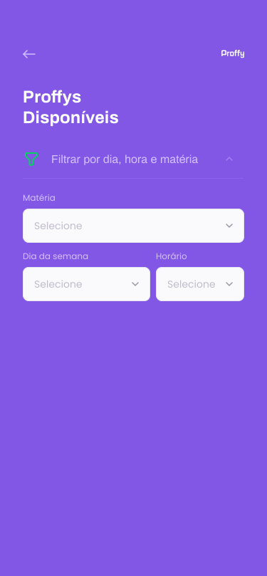

  

Mobile and web application of aulas onlines, built in one week Omnistack

  
 

<h1 align="center">Mobile Version</h1>

<table>
  <tr>
    <td>
      

        
      

    </td>
    <td>
      

        
      

    </td>
    <td>
      

        
      

    </td>
  </tr>
</table>

  
 

 
  <h2 align="center">FEATURES :book:</h2>
 

This app features all the latest tools and practices in mobile development!

- ⚛️ **React Js** 	- A JavaScript library for building user interfaces
- ⚛️ **React Native** 	- A lib that provides a way to create native apps for Android and iOS
- 💹 **Node Js** 	- A web framework for Node Js
- 📄 **SQlite** 		- A cross-platform and open-source Structured Query Language.
- 📊 **Knex Js** 		- Dependency for using the database.
- ☯️ **Insomnia** 	- HTTP request software and with open source.
- 🔄 **Nodemon** 	- Reload server automatically.
- ⚠️ **Cors** 	- Dependency so you don't have access to external links.
- 🔀 **Axios** 	- Promise based HTTP client.

## Getting started

1. Clone this repo using `git clone https://github.com/CaioHenriqueMachado/PROFFYS-project.git`
2. Move yourself to the appropriate directory: `cd Proffys` 
3. Run `npm` to install dependencies 

### Getting started with the backend server

1. Move yourself to the backend folder: `cd server`
2. Run `npm run start` to start the server

### Getting started with the frontend app

1. Move yourself to the frontend folder: `cd web`
2. Run `npm start` to start the web application

### Getting started with the mobile app

1. Move yourself to the mobile folder: `cd mobile`
2. Run `expo start` to start the mobile app

